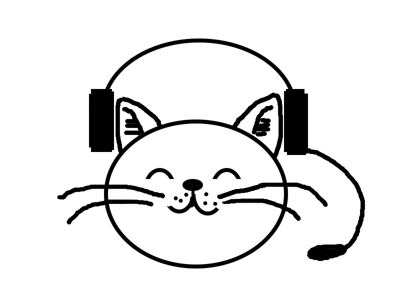

# audiocat
Audiocat is a command-line utility for Linux that reads and writes encrypted data across peer-to-peer audio connections, using [minimodem](https://github.com/kamalmostafa/minimodem "minimodem") and [gpg](https://github.com/gpg/gnupg "gpg").

It is a powerful tool that can be combined with any audio infrastructure (like PSTN, cellular network, internet, radio) to provide a secure communication channel through an audio tunnel.

The audio interfaces behave like data-diodes, each allowing unidirectional data transmission only, thus preventing data-leaks and malware-injection.

This enables an "enhanced"-end-to-end encryption (E-E2EE) which notably increases security and privacy, especially when the end devices are completely offline (air-gapped-system).

See also <https://www.codeproject.com/Articles/5295970/Audio-Chat-for-Quite-Good-Privacy-AC4QGP>


## Installation
```sh
  git clone https://github.com/ClarkFieseln/audiocat.git
  (not yet supported: pip install audiocat-clark)
  
  # dependencies:
  sudo apt update
  sudo apt install minimodem
  sudo apt install gpg
```

## How to use it?
### Chat/Messenger:

```sh
  ./audiocat -c
```
enter and confirm password

On the other device a chat or even a reverse shell can be started.

### Reverse Shell:

```sh
  ./audiocat -s
```
then enter and confirm password

On the other device a chat shall be started to command the remote shell.

### File Transfer:

```sh
  ./audiocat -f
```
enter and confirm password

On the other device a file transfer shall be started.

### Probe:
(to check connectivity and adjust volumes if required)

```sh
  ./audiocat -p
```
a new terminal is opened for the transmitter.

Configuration settings can be adapted in folder cfg.

For a detailed documentation check the Article in Code Project (the link will be provided soon).

## Features:
on top of the audio modem provided by minimodem and encryption provided by GPG, audiocat offers a reliable transport layer and many other features:

- modes: chat, reverse-shell, file transfer (future: sniffer)

- full-duplex communication

- retransmit messages automatically after communication errors

- split big messages into smaller data chunks in order to increase the probability of reception, thus reducing retransmissions

- [keepalive] messages

  this feature was extremely important in my set up in order to prevent "binary data / noise" after pauses
  
  when minimodem is not used for longer than some seconds the amount of initial noise/problems in the transmission increases
  
- redundant transmission of "data-messages" to increase probability of successfull reception

   all redundant messages received "after" a successfull reception are just ignored for processing but acknowledged,
   
   the total transmission time (including all redundant messages) shall be below the roundtrip-delay,
   
   an excessive number of redundant transmissions will increase delays and may block messages sent by the other side)
   
- composition of piped commands hidden to the user

- tmp folder located in a configurable path beneath $HOME, independent of the current path.

- probe, to check volume on receiver and adjust manually if needed,

  very high and very low volumes may produce signal distortions
  
- "braodcast" transmissions also possible, e.g. when ACKs are dactivated

   use-case: walkie-talkie, Radio station, ...
   
- several configuration options, preamble, trailer, delays, cipher algorithm, confidence, log to file, verbose, etc.

## Possible Abuses:
please don't do the following if you are not allowed (it might be illegal!):

- exfiltrate data over the air or cable to a nearby or remote computer

- remote control over the air or cable from a nearby or remote computer

- exfiltrate data from a computer evading classical auditing

  (be aware that if you do this on your employer's computer you might be infringing the law!)
  
- use the tool as a "side-channel" for covert communication e.g. to spread or inject malware,

  even worse when combined with steganography (e.g. low volumes, data hidden in noise)
  
## PyPi Project

https://pypi.org/project/audiocat-clark

## Article in Code Project

(the link will be provided soon)

## GitHub Repository

https://github.com/ClarkFieseln/audiocat

## License

(c) 2024 Clark Fieseln

This repository is licensed under the MIT license. See LICENSE for details.
